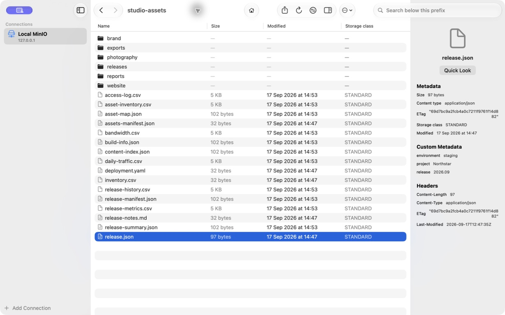
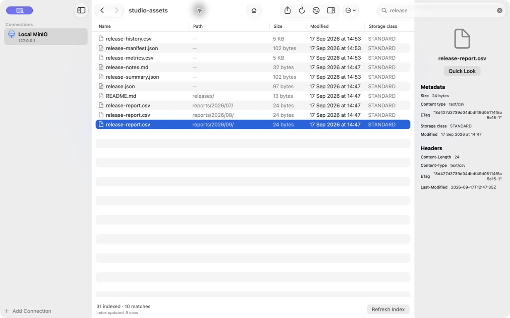

<p align="center">
  
</p>

<h1 align="center">S3Workbench</h1>

<p align="center">
  A native macOS browser for S3-compatible object storage.<br>
  Browse buckets, search across prefixes, and transfer files from your Mac.
</p>

<p align="center">
  <a href="https://github.com/romainfrezier/S3Workbench/actions/workflows/ci.yml"></a>
  <a href="https://github.com/romainfrezier/S3Workbench/releases/latest"></a>
  
  
  <a href="LICENSE"></a>
</p>

Connect your S3 workspaces with independent endpoints, regions and access roots.
Keep credentials in macOS Keychain and your everyday workflow in one native app.

## Screenshots

<p align="center">
  
</p>

<p align="center">
  
</p>

Real S3Workbench 0.7.0 windows, shown with synthetic demo data.

## Why S3Workbench?

S3Workbench brings your MinIO, RustFS, private infrastructure, and hosted object storage into one native macOS app. Save your connections and use the same browsing, search, and transfer tools for each one.

- Save and switch between multiple independent storage connections.
- Color-code and duplicate saved connections.
- Configure arbitrary servers without embedding a protocol, plus HTTPS, port, region, and addressing settings.
- Open an optional `/bucket/prefix` access path directly when credentials cannot list every bucket.
- Browse buckets and prefixes with native macOS tables, navigation, search, inspector, keyboard commands, and Quick Look.
- Copy exact object keys or portable S3 URIs, and use **Navigate → Go to Location…** (`⇧⌘G`) to open either within the current bucket.
- Upload, stream downloads, delete, move, drag and drop, inspect metadata, and create presigned URLs.
- Choose Keep Both, Replace, or Cancel before a transfer or move can overwrite a destination.
- Search recursively, then reuse a persistent local index for subsequent queries.
- Track transfers with progress, cancellation, retry, and bounded-memory multipart uploads.
- Keep credentials out of configuration files and logs.

Go to Location preserves exact key bytes and respects the connection's access root. URI input uses `s3://bucket/encoded-key`; use **Copy S3 URI** for spaces, Unicode, reserved characters, or keys that themselves look like URIs. It never switches buckets or connections automatically. Successful navigation and **Reveal in Prefix** scroll the selected object into view.

## Compatibility

Connect to hosted object storage, local development servers, or your own
infrastructure using a configurable S3 endpoint.

| Storage | Connection setup |
| --- | --- |
| MinIO & RustFS | Your server endpoint, path-style addressing, HTTP or HTTPS |
| Amazon S3 | Regional endpoint and signing region |
| Cloudflare R2 | Account endpoint and `auto` region |
| Wasabi & Backblaze B2 | Regional S3 endpoint and signing region |
| Private S3-compatible storage | Custom endpoint, port, addressing style, and optional custom CA |

Each connection has its own credentials and settings. Open a specific
`/bucket/prefix` directly when your access is limited to one part of a bucket.
Browse, search, inspect and transfer objects without changing tools.

Provider configuration and validation are different things: the reproducible
MinIO and RustFS environments, covered operations and live-provider evidence
are documented in [Testing](docs/TESTING.md).

## Install

S3Workbench requires macOS 15 or later on Apple Silicon.

### Homebrew

Use the personal [Homebrew tap](https://github.com/romainfrezier/homebrew-s3workbench):

```sh
brew tap romainfrezier/s3workbench
brew trust --cask romainfrezier/s3workbench/s3-workbench
brew install --cask s3-workbench
```

To upgrade:

```sh
brew update
brew upgrade --cask s3-workbench
```

The [cask](https://github.com/romainfrezier/homebrew-s3workbench/blob/main/Casks/s3-workbench.rb)
uses the versioned release DMG and verifies its SHA-256. Upgrades preserve saved
profiles, preferences, local indexes and Keychain credentials. Homebrew provides
the update command; S3Workbench has no in-app updater.

### Manual DMG

1. Download the versioned `S3Workbench-X.Y.Z.dmg` and checksum from the [latest release](https://github.com/romainfrezier/S3Workbench/releases/latest), then verify them with `shasum -a 256 -c S3Workbench-X.Y.Z.dmg.sha256`.
2. Open the disk image and drag S3Workbench to Applications.
3. Launch the app and add your first connection.

Both installation methods use the same ad-hoc-signed, unnotarized community build.
Homebrew does not grant Developer ID trust or bypass Gatekeeper. If macOS blocks
first launch, review it through the standard **Privacy & Security** controls.
See [Packaging and distribution](docs/PACKAGING.md) for distribution limits and
the notarized-build workflow.

## Connection model

Each saved connection contains:

- a display name;
- a server name, HTTPS setting, and port (`443` by default);
- an optional direct access path such as `/etickets` or `/bucket/prefix`;
- a sidebar color;
- a signing region;
- path-style, virtual-hosted-style, or automatic addressing;
- system trust or a connection-scoped custom CA certificate;
- an access key and secret access key stored under an opaque connection UUID in macOS Keychain.

Automatic addressing is compatibility-first and prefers path-style for arbitrary endpoints. Explicit virtual-hosted style remains available when DNS and certificates cover bucket subdomains.

When an access path is configured, S3Workbench tests and opens that bucket/prefix directly instead of requiring `ListAllMyBuckets`. This supports credentials intentionally restricted to one remote root.

## Security

- Credentials are stored in macOS Keychain, never in profile JSON.
- Authorization headers, credentials, signatures, session tokens, and presigned query values are redacted from surfaced errors.
- System TLS verification is the default; a custom PEM CA can be scoped to one connection.
- Disabling TLS verification is intentionally unsupported. Plain HTTP remains available for explicitly configured local/private endpoints and is visibly marked as insecure.
- Presigned URLs are bearer credentials and should be shared carefully.

Please report vulnerabilities privately using the repository's [security advisory form](https://github.com/romainfrezier/S3Workbench/security/advisories/new), not a public issue. Read the full [security policy](docs/SECURITY.md).

## Architecture

```text
SwiftUI views
    ↓
Workbench service + transfer coordinator
    ↓
S3WorkbenchCore domain API
    ↓
AWS SDK for Swift + app-owned SigV4 presigner
    ↓
Any explicitly configured S3-compatible endpoint
```

The UI contains no signing, XML, Keychain, or networking logic. The AWS SDK handles the S3 protocol surface, while the app owns endpoint policy, persistence, TLS configuration, error redaction, transfer orchestration, and custom-endpoint presigning. More detail is available in [Architecture](docs/ARCHITECTURE.md).

## Build and test

Requirements:

- Apple Silicon Mac;
- macOS 15 or later;
- Xcode 26 or later;
- Docker Desktop for the MinIO and RustFS integration suites.

```sh
swift test
scripts/integration-test.sh
S3_TEST_PROVIDER=rustfs scripts/integration-test.sh
VERSION=0.7.0 # Example: use the version you are building.
MARKETING_VERSION="$VERSION" scripts/package-dmg.sh
MARKETING_VERSION="$VERSION" LAUNCH_TEST=1 scripts/verify-dmg.sh
```

The integration environment is isolated, pinned by container digest, and removed on exit. It covers authentication, restricted bucket permissions, direct access roots, buckets, prefixes, pagination, unusual object names, metadata, upload/download/delete/move, presigned GET, and multipart upload with SHA-256 verification. See [Testing](docs/TESTING.md).

## Project status

S3Workbench is an early public release. Maintainer-approved work is tracked in
[open roadmap issues](https://github.com/romainfrezier/S3Workbench/issues?q=is%3Aissue%20state%3Aopen%20label%3Aroadmap).
Questions and ideas that are not yet ready for implementation belong in
[GitHub Discussions](https://github.com/romainfrezier/S3Workbench/discussions).

## Support

<p>
  <a href="https://buymeacoffee.com/romainfrezier">
    
  </a>
</p>

## Deliberate non-goals

S3Workbench intentionally remains an object browser rather than a storage
administration or synchronization suite. The following are not planned for now:

- local-to-S3 synchronization or mirroring;
- bucket administration, policies, lifecycle, or replication;
- regex, glob, saved queries, or advanced filters;
- transfer resumption after the application exits;
- full AWS profile, SSO, or credential-provider-chain support;
- object-version browsing and restoration;
- expanded presigned URL workflows.

## Contributing

Issues and pull requests are welcome. Start with [CONTRIBUTING.md](CONTRIBUTING.md), follow the [Code of Conduct](CODE_OF_CONDUCT.md), and use GitHub Discussions for usage questions and ideas that are not yet actionable bug reports.

## License

S3Workbench is available under the [MIT License](LICENSE).
